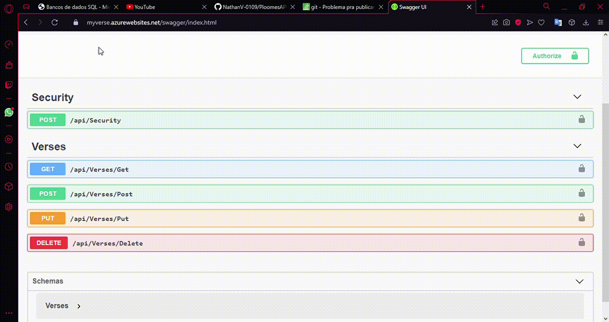

<h1>My Verse API</h1> 

<p align="left">

  
   
</p>

> Status do Projeto: :heavy_check_mark:  concluido 

### Tópicos 

:small_blue_diamond: [Descrição do projeto](#descrição-do-projeto)

:small_blue_diamond: [Funcionalidades](#funcionalidades)

:small_blue_diamond: [Como rodar a aplicação](#como-rodar-a-aplicação-arrow_forward)

:small_blue_diamond: [Ferramentas utilizadas](#ferramentas-utilizadas)

## Ferramentas Utilizadas

:heavy_check_mark: Asp.Net/C#  

:heavy_check_mark: Sql Server  

:heavy_check_mark: Azure  

:heavy_check_mark: Swagger  

## Descrição do projeto 

<p align="justify">
  Esta API tem como objetivo gerenciar/guardar notas relacionadas a versículo biblico
  Através dessa API, você consegue guardar o livro, seu respectivo capitulo, versiculo e o texto, não é necessário colocar o Id, pois o banco em sua inserção gerencia os Ids.
  Esta API também contém um serviço de Login, o usuário coloca seu User e Password e então é gerado um token de acesso para ações de inserções, modificações e remoções no banco 
</p>

## Funcionalidades

:heavy_check_mark: Autenticação

:heavy_check_mark: Inserir Dados 

:heavy_check_mark: Remover Dados

:heavy_check_mark: Alterar Dados  

:heavy_check_mark: Visualizar Dados  


## Como rodar a aplicação :arrow_forward:

Para este desafio, foi disponibilizado um site para realizar testes, onde ele está integrado com o banco de dados do Azure, o link é o seguinte:

```
https://myverse.azurewebsites.net/swagger/index.html
```

Com ele você consegue testar todas as funcionalidades ditas neste documento  
:warning: Lembrando que para poder inserir, modificar ou remover itens será necessário autenticação  
:warning: Por ser um teste, o login possui um User e Password padrão respectivamente ```"Admin"```  ```"Teste123"```, Em uma API de fato não se deve colocar esses dados sensiveis no back-end, além de ser uma má prática é um risco a segurança.




## Licença 

The [MIT License]() (MIT)

Copyright :copyright: 2021 - My Verse API
